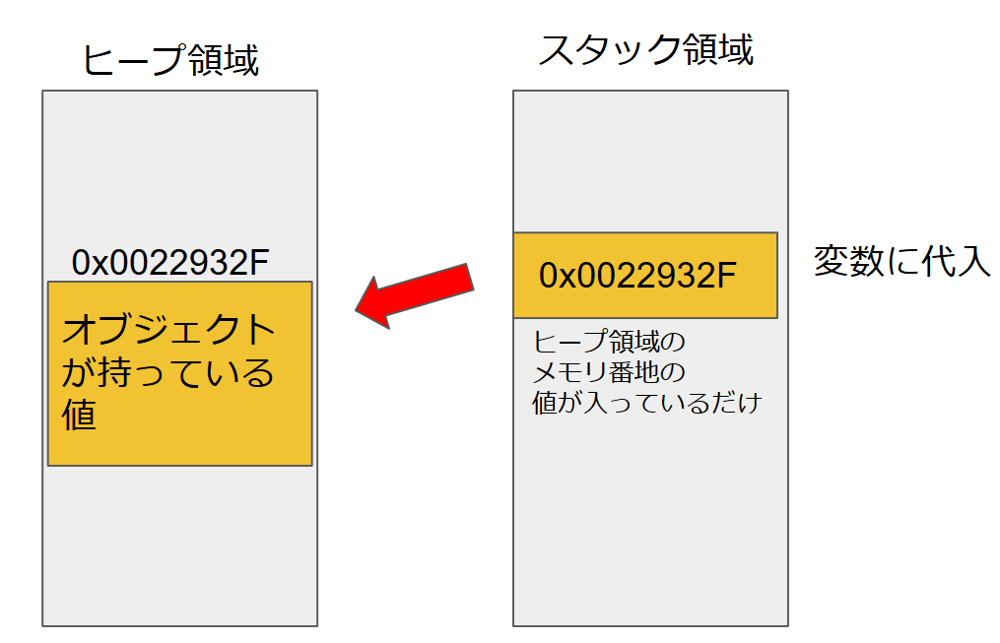
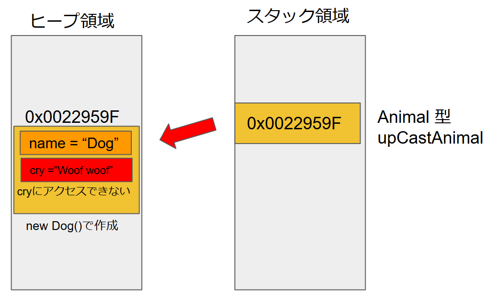
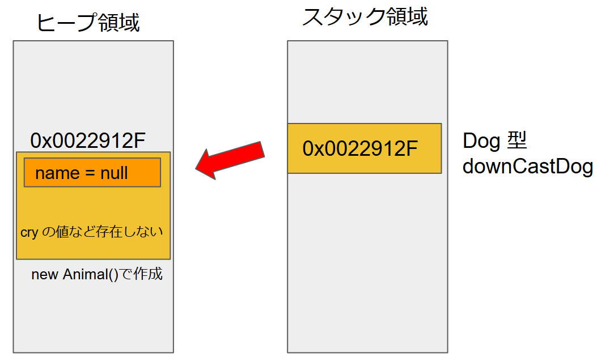
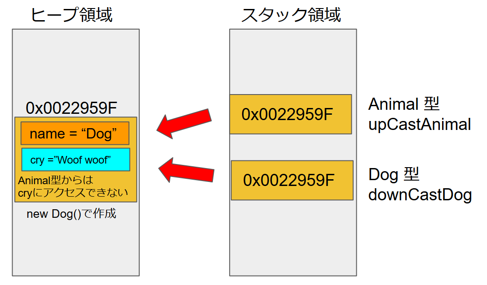

目次
<!-- @import "[TOC]" {cmd="toc" depthFrom=1 depthTo=6 orderedList=false} -->
<!-- code_chunk_output -->

- [キャストは何を行っているのか](#キャストは何を行っているのか)
  - [キャスト](#キャスト)
  - [メモリ確保](#メモリ確保)
    - [アップキャスト](#アップキャスト)

<!-- /code_chunk_output -->

# キャストは何を行っているのか

## キャスト
C#やJavaなどオブジェクト指向にキャストという型変換がある。  
最初習うときはなんかAsを使えば変換できるらしい、但し、それは継承の関係でないといけない。  
くらいにしか思わないが実際にメモリの中で何が起こっているのかを知らないとちゃんと理解したことにならない。

## メモリ確保

オブジェクトを変数に格納するとき、実際のオブジェクトを入れているのではなく、ヒープ領域に作成されたオブジェクトのアドレス番号を入れているだけというは知っていると思う。



これを踏まえてキャストを考えてみる

以下のコードの場合で説明する
```CS
class Program
{
    static void Main(string[] args)
    {
        Animal upCastAnimal = new Dog();
        Dog downCastDog = (new Animal() as Dog);
    }
}

class Animal
{
    public string name;
}
class Dog : Animal
{
    public string cry;
    public Dog()
    {
        name = "Dog";
        cry = "Woof woof";
    }
}
```

### アップキャスト

この場合、アップキャストの
```CS
Animal upCastAnimal = new Dog();
````
はDogのnewしているため、`name = "Dog"`,`cry = "Woof woof"`という持っています。そのオブジェクトをAnimal型に型変換して変数に代入しています。  
この場合、スタック領域上ではAnimal型が持っているメンバのみしかアクセスをできないようにして、型変換を行っているのです。つまりヒープ領域上には`cry = "Woof woof"`の値を持ち続けているのです。



CryはAnimalを継承しているのであたり前ですが、必ず、nameを持っています。そのためアップキャストは安全に行うことができるということになります。  

### ダウンキャスト

逆に、エラーになる可能性があるダウンキャスト
```CS
Dog downCastDog = (new Animal() as Dog);
````
はAnimalをnewしているため、`name`は確保しますが、cryは作成されません。それをDog型に変更しようとしています。これでは変換できずに`downCastDog = null`になってしまいます。  
```CS
Dog downCastDog = (Dog)new Animal();
```
の場合は`System.InvalidCastException`のエラーがスローされる。



ただし、これはAnimalをnewしたときだからであって、newしたときがDogだった場合、もしくはDogを継承したクラスをnewした場合は、Animal型でも変換できます。そのAnimal型はアクセスできないようにされているだけで、ヒープ領域にある実際のオブジェクトには値があるからです。

例として以下の場合
```CS
Animal upCastAnimal = new Dog();
Dog downCastDog = upCastAnimal as Dog;
```

upCastAnimalもdownCastDogも実際に参照しているオブジェクトは同じで、upCastAnimalは`name`しかアクセスできず、downCastDogは`name`と`cry`両方アクセスできるような変数になるということになる。



ここではメンバ変数を例に挙げているがメソッドやプロパティも同様のことが言えます。※実際はメソッドコードは静的領域にあるが原理は同じ  

このようなことがあるため、ダウンキャストはコンパイルエラーにはならないが実行してみると失敗しているということが起こる。  
例の場合は、newの直後にキャストしているので間違いは一目瞭然だが、実際のコードではどこでnewされたかは元をたどっていかないとわからない。  
そのためダウンキャストはできるだろうとせずに、できなかった場合の処理も書いておくべきである。  
そもそもダウンキャストしなくてもいいようにクラス設計するが一番ですが。  

