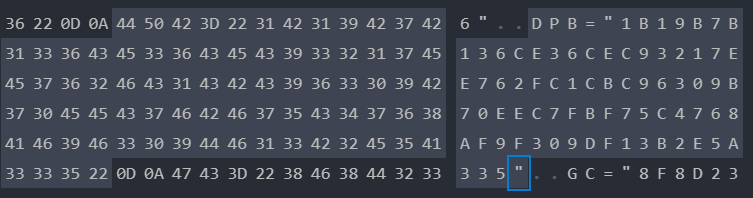
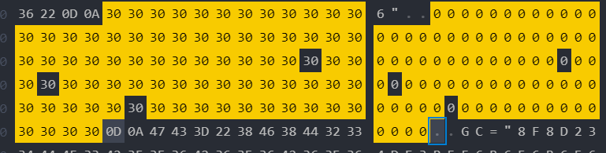
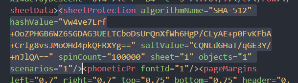

目次
<!-- @import "[TOC]" {cmd="toc" depthFrom=1 depthTo=6 orderedList=false} -->
<!-- code_chunk_output -->

- [エクセルのパスワードを削除する方法](#エクセルのパスワードを削除する方法)
  - [VBAのパスワード](#vbaのパスワード)
  - [シートの保護のパスワード](#シートの保護のパスワード)

<!-- /code_chunk_output -->

# エクセルのパスワードを削除する方法

2007以降のファイル形式の場合(拡張子が4文字あるもの)  
エクセルの実態はxmlファイルをzipで固めたものなので、zipから開ければパスワードを書き換えできる。  
ただし、エクセル自体にパスワードがあるものは暗号化されているのでこの場合は、総当たり攻撃でしかないです。  
なお旧式ファイルの場合はすべてバイナリを弄れば突破できるのでセキュリティ的にもはやり2007以降のファイル形式にすべきである。

**※ 悪用は厳禁。引継ぎがいなくなったときの最終手段として使ってください**

## VBAのパスワード

1. 解除したいエクセルファイルの拡張子を`zip`に変更する。
2. `xl\vbaProject.bin`のファイルを見つけ、適当な場所に保存する
3. このファイルをバイナリエディタを使って開く  
   (説明ではVSCodeのHex Editorを使用する)
4. 検索機能で対象をテキストにして、`DPB`を検索する

1. この`DPB="～～～～～"`が箇所がパスワードが記載されているものです。この箇所を適当な文字で埋めて保存する

6. 修正したファイルをzip側に上書きし、拡張子を戻して、開く
7. VBEを開こうとするとダイアログがでますが、`はい`を押す
8. 『予知せぬエラーが発生しました』とでるが何度もOKを押し続けるとVBEが開く。
9. ツール→VBAProjectのプロパティでダイアログを開き、保護のタブから適当にパスワードをいれる
10. するとマクロが開けるようになる。9.で設定したパスワードを解除すれば完了です。

## シートの保護のパスワード
1. 解除したいエクセルファイルの拡張子を`zip`に変更する。
2. `xl\worksheets`を開き対象のシートのxmlファイルを適当な場所に保存する
3. このファイルを開いて`sheetProtection`の要素を見つけて削除する

4. 修正したファイルをzip側に上書きし、拡張子を戻して、開くと保護がなくなっている

