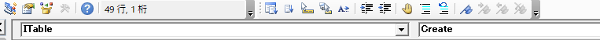
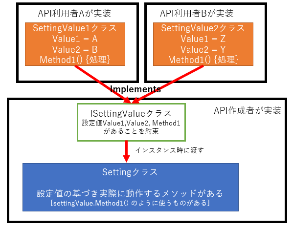

目次
<!-- @import "[TOC]" {cmd="toc" depthFrom=1 depthTo=6 orderedList=false} -->
<!-- code_chunk_output -->

- [Strategyパターンを使ってTableクラスを作成する](#strategyパターンを使ってtableクラスを作成する)
    - [Tableクラスを作るとなにがうれしいのか](#tableクラスを作るとなにがうれしいのか)
    - [便利なのはわかった。でもクラス作るの面倒くない？](#便利なのはわかったでもクラス作るの面倒くない)
    - [実装例](#実装例)
      - [ソースコード](#ソースコード)
      - [説明](#説明)
    - [なにがうれしいのか](#なにがうれしいのか)
    - [Strategyパターンはオブジェクト指向言語以外でも使える](#strategyパターンはオブジェクト指向言語以外でも使える)

<!-- /code_chunk_output -->

# Strategyパターンを使ってTableクラスを作成する

### Tableクラスを作るとなにがうれしいのか

本題に入る前にTableクラスを作る利点の紹介  

エクセルVBAで表から値を拾って、なんらかの処理を行う  
よくある処理だと思います。  
このとき最速の値の取得方法は  
```VB
Dim Table() As Variant
Table() = Range("範囲").Value
```
です。この方法だと表が大きくても一瞬で配列として取得できます。  
もし、作成しているツールが一回きりでメンテナンス作業がないのならこの方法で問題ありません。処理も一番早いです。  
しかし、作成しているものが今後もメンテナンスが必要だし、仕様がかわるかも…って場合はこの方法はあまり得策ではありません。  
例えば仕様変更で列が追加になったとなると
```VB
'元々の処理
For Row = 1 To UBound(Table, 1)
    Name = Table(Row, 1)
    Address = Table(Row, 2)
    PhoneNumber = Table(Row, 3)
    'なんらかの処理
Next

'苗字と名前を別々にすることになった。B列追加ね という仕様変更
For Row = 1 To UBound(Table, 1)
    FirstName = Table(Row, 1)
    LastName = Table(Row, 2)
    Address = Table(Row, 3)
    PhoneNumber = Table(Row, 4)
    'なんらかの処理
Next
```
このように番号がずれてしまいます。マクロが長い場合これを漏れなく修正するのはしんどく、漏れたことにも気づきにくいのが問題です。  
さらにマジックナンバーをつかっているので、列番号を忘れるといちいちエクセルとにらめっこする必要がでてきます。

こういう事故を起こしたくない場合はクラスを使うことで解決します。  
Tableクラスという作成すれば
```VB
Dim myTable As New Table
myTable.Init Range("範囲")
```
のように宣言することで
```VB
For Row = 1 To myTable.Rows
    FirstName = Table(Row).FirstName
    LastName = Table(Row).LastName
    Address = Table(Row).Address
    PhoneNumber = Table(Row).PhoneNumber
    'なんらかの処理
Next
```
のように使用できます。  
この場合、Rangeなどと同じようにインテリセンス(入力候補)が出るので、使う側は迷うことメンバを使うことができます。  
もし、仕様変更があってもクラス内のセットする処理を変更すれば、使う側は修正を行わずに全て反映されます。これは大規模になるほど実感すると思います。  

### 便利なのはわかった。でもクラス作るの面倒くない？

そうです。結構面倒くさいです。

保存したいパラメータが多い場合は、Tableクラスとパラメータを保存するクラスが必要なり、Tableの処理をするたびにいちいち1から作成しなければなりません。
そこで、そこを楽するためにインターフェースを使います。  
VBAで継承はできませんが、インターフェースが使えます。  
そして、デザインパターンの中でもよく使われるStrategyパターンはインターフェースさえあれば実装できるので、VBAでも可能ということです。  

### 実装例
#### ソースコード


[ITableクラス](/ExcelVBA/Table/ITable.cls)   
[Tableクラス](/ExcelVBA/Table/Table.cls)  
[PersonTableクラス](/ExcelVBA/Table/PersonTable.cls)  

#### 説明

まずインターフェースITableクラスを作成します。
インターフェースの書き方は
```VB
Public Function Create(ByVal Table As Variant, ByVal Cell As Range) As Collection
End Function
```
のように具体的な処理を書かないメンバを作成します。  
このCreateメソッドで実際の値をプロパティに設定していきます。  

インターフェースを使う側のPersonTableクラス
```VB
Implements ITable

'インスタンス変数
Private Name_ As String
Private Address_ As String
Private PhoneNumber_ As String

'''<summary> 名前(取得)
'''<param> なし
'''<returns> 名前
Public Property Get Name() As String
    Name = Name_
End Property

'''<summary> 住所(取得)
'''<param> なし
'''<returns> 住所
Public Property Get Address() As String
    Address = Address_
End Property

'''<summary> 電話番号(取得)
'''<param> なし
'''<returns> 電話番号
Public Property Get PhoneNumber() As String
    PhoneNumber = PhoneNumber_
End Property

'''<summary> ITableで約束した値のCollectionを作成する
'''<param> テーブル, 基準となるセル
'''<returns> 値が入ったCollection
Private Function ITable_Create(ByVal Table As Variant, ByVal Cell As Range) As Collection
    Dim Coll As Collection
    Set Coll = New Collection
    Dim NewItems As PersonTable
    Dim Row As Long
    For Row = LBound(Table, 1) To UBound(Table, 1)
        Set NewItems = New PersonTable
        NewItems.Init Table, Row
        Coll.Add NewItems
    Next
    Set ITable_Create = Coll
End Function

'''<summary> 値を設定する
'''<param> テーブル
'''<returns> なし
Public Function Init(ByVal Table As Variant, ByVal Row As Long)
        Name_ = Table(Row, 1)
        Address_ = Table(Row, 2)
        PhoneNumber_ = Table(Row, 3)
End Function
```
まず最初に
```VB
Implements ITable
```
と宣言することでITableインターフェースを使う宣言をします。

そして、各項目のプロパティを作成します。  
(ここが結構面倒… C#なら1行で書けるのに)  
そして、ITableで約束したCreateメソッドを作成します。  
```VB
'''<summary> ITableで約束した値のCollectionを作成する
'''<param> テーブル, 基準となるセル
'''<returns> 値が入ったCollection
Private Function ITable_Create(ByVal Table As Variant, ByVal Cell As Range) As Collection
    'ITable.Createで呼ばれたときの処理
End Function
```
なお`Implements ITable`を宣言していると、ソースコードの上側にある ↓これ  
   
をITableを選択すると自動的にFunctionを作ってくれます。

そしてInitで値を設定するメソッドを作成しておきます。  
```VB
'''<summary> 値を設定する
'''<param> テーブル
'''<returns> なし
Public Function Init(ByVal Table As Variant, ByVal Row As Long)
        Name_ = Table(Row, 1)
        Address_ = Table(Row, 2)
        PhoneNumber_ = Table(Row, 3)
End Function
```
最初の例で上げた仕様変更で列番号が変わった場合、ここを変更することになります。  
使う側はなにも変える必要はありません。(これがとてもうれしい)

最後にテーブルを扱うTableクラスを作成します。
(重要なところ以外は省略しています)
```VB
'インスタンス変数
Private Table_() As Variant
Private Items_ As Collection

'''<summary> テーブルを取得する(コンストラクタ)
'''<param> ITableをImplementsしたクラス、基準となるセル
'''<returns>なし
Public Function Init(ByVal TableClass As ITable, ByVal SelectCell As Range)
    'テーブルを取得する処理
    Set Items_ = TableClass.Create(Table_(), SelectCell)
End Function

'-----------------------------------------------
'テーブル処理でよくやる処理をメソッドとして実装する
'-----------------------------------------------

'''<summary> 各項目がセットされたクラスを返す
'''<param> テーブルの行番号
'''<returns>Item型(各項目の値)
'''<remarks>デフォルトメンバ
Public Function Items(ByVal Row As Long) As ITable
Attribute Items.VB_UserMemId = 0
    On Error GoTo Err01
    Set Items = Items_(Row)
    Exit Function
Err01:
    err.Raise 9001, , "存在しない行番号です"
End Function

'''<summary> 反復処理をサポートする ※単独では使用できません
'''<param> なし
'''<returns> なし
Public Function NewEnum() As stdole.IUnknown
Attribute NewEnum.VB_UserMemId = -4
        Set NewEnum = Items_.[_NewEnum]
End Function
```

長いので1個ずづ説明

コンストラクタ
```VB
'''<summary> テーブルを取得する(コンストラクタ)
'''<param> ITableをImplementsしたクラス、基準となるセル
'''<returns>なし
Public Function Init(ByVal TableClass As ITable, ByVal SelectCell As Range)
    'テーブルを取得する処理
    Set Items_ = TableClass.Create(Table_(), SelectCell)
End Function
```
実質的なコンストラクタ(VBAでは引数を渡せないため)としているInitメソッドは`ByVal TableClass As ITable`とすることで、ITableのインターフェースをつかったもの引数として設定できます。  
これはITable型を渡してほしいのではなくITableインターフェイスを実装したクラスを渡して欲しいという意味です。  
VBAでは殆どみることはないかもしれませんが、オブジェクト指向の言語だとよくあるパターンです。  
なおVBAだとインターフェースもNewできてしまうので注意してください。  
(C#だとコンパイルエラーCS0144でNewできねーぞと教えてくれる)  

SelectCellは表の一番左上のセルを指定します。  
これらの引数を使って、ITableで約束したCreateメソッドに渡します。  
こうすることで、TableClassで渡されたクラスによってCreateメソッドの実際の処理が変わります。

Getterメソッド
```VB
'''<summary> 各項目がセットされたクラスを返す
'''<param> テーブルの行番号
'''<returns>Item型(各項目の値)
'''<remarks>デフォルトメンバ
Public Function Items(ByVal Row As Long) As ITable
Attribute Items.VB_UserMemId = 0
    On Error GoTo Err01
    Set Items = Items_(Row)
    Exit Function
Err01:
    err.Raise 9001, , "存在しない行番号です"
End Function
```
次に値を取得したいときに使うメソッドを作成します。  
このメソッドの戻値はITableになっています。  
といってもインスタンス変数にあるコレクションの値を返すので実際は、インスタンス時に渡したクラスがITableとして返ってくることになります。  

本題の件と関係ありませんが
```VB
Attribute Items.VB_UserMemId = 0
```
とすることで、デフォルトメンバとして扱うようになります。  
つまり、`myTable(1)`と`myTable.Items(1)`が同じ扱いになります。   
Collectionを使うときわざわざ`Coll.Item(1)`とせずに`Coll(1)`と取得できるのはこのデフォルトメンバのおかげです。  

最後におまけ
```VB
'''<summary> 反復処理をサポートする ※単独では使用できません
'''<param> なし
'''<returns> なし
Public Function NewEnum() As stdole.IUnknown
Attribute NewEnum.VB_UserMemId = -4
        Set NewEnum = Items_.[_NewEnum]
End Function
```
これも本題の件と関係ありませんがあったら便利です。  
詳しくは説明しませんがこれを作ることでFor EachでItemsを回すことができます。

つまり
```VB
Dim Items As PersonTable
For Each Items In myTable
    FirstName = Items.FirstName 
    '処理いろいろ
Next
```
のように扱うことができます。超便利

最後に使う側は

```VB
Dim myTable As New Table
myTable.Init New PersonTable, Range("範囲")
```

### なにがうれしいのか

ITableを使うことで他のテーブルを作りたい場合でもTableのコードを弄る必要がなくなります。  
つまり具体的に値をいれるクラス(例の場合PersonTableクラス)を作成してしまえば、同じようにTableクラスを扱うことができるのです。このようなパターンをStrategyパターンといいます。  


```VB
'PersonTable型を使いたい場合
Dim MyTable As New Table
MyTable.Init New PersonTable, Range("B6")
Dim Items As PersonTable
For Each Items In MyTable
    Debug.Print Items.Name
Next

'ItTableインターフェースを実装したSalesTableを新たに作成
'SalesTable型を使いたい場合
Dim MyTable As New Table
MyTable.Init New SalesTable, Range("G6")
Dim Items As SalesTable
For Each Items In MyTable
    Debug.Print Items.Tokyo
Next
```
サンプル  
[SalesTableクラス](/ExcelVBA/Table/SalesTable.cls)  

このようにInitメソッドに渡すクラスを変えるだけでItemsが持っているクラスを変更することができます。そして、Tableクラスに実装しているメソッドはどちらとも共通して使うことができます。  

これを作成するまでは、
```
A_Table
A_Items
B_Table
B_Items
C_Table
C_Items
etc...
```
のようにTableクラスは個々で作って、新しいメソッドを作る度にほかのTableクラスに追記していました。  
しかし、これを使うことで、
```
Table
ITable
A_Items
B_Items
C_Items
etc...
```
のようにTableクラスが一つになるのでTableクラスを修正すれば全部のテーブルにメソッドを修正したことになるので管理も大幅に楽になります。

### Strategyパターンはオブジェクト指向言語以外でも使える

このStrategyパターンはデザインパターンの中でも扱い安く、API作成でもよく使われている手法です。  

例えばソフトで設定をクラスで決めたいときAPI作成者は  
Setting //実際に設定の動作をするクラス  
ISettingValue //設定値と約束するインターフェース  
を実装し、API利用者は  
SettingValue1 //ISettingValueのインターフェースを実装した設定値  
を作成してしまえば、Settingクラスのインスタンス時に自分が作成した設定値やメソッドを使って設定することができます。



このパターンはインターフェースが使える言語なら同じようなことができるので  
オブジェクト指向の言語でない場合でも知ってると使える場面がわりとあると思います。

