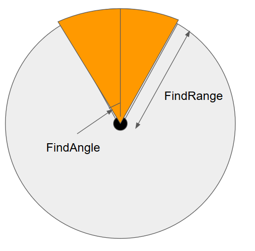

目次
<!-- @import "[TOC]" {cmd="toc" depthFrom=1 depthTo=6 orderedList=false} -->
<!-- code_chunk_output -->

- [敵の方向に向くスクリプト](#敵の方向に向くスクリプト)
  - [Step 1 無条件で敵の方向を向く](#step-1-無条件で敵の方向を向く)
  - [Step 2 視界に入った場合にのみ敵の方向を向く](#step-2-視界に入った場合にのみ敵の方向を向く)
  - [Step 3 当たり判定のある壁は視界を遮るようにする](#step-3-当たり判定のある壁は視界を遮るようにする)

<!-- /code_chunk_output -->

# 敵の方向に向くスクリプト


## Step 1 無条件で敵の方向を向く

とりあえず敵のオブジェクトがいたら即座にその方向を向くスクリプト  
敵設定オブジェクトをインスペクターで設定しておく

```CS
using UnityEngine;

public class EnemyAttack : MonoBehaviour
{
    [SerializeField] private GameObject Enemy;

    void Update()
    {
        if (Enemy == null) { return; }   
        Vector3 diff = (Enemy.transform.position - transform.position);
        transform.rotation = Quaternion.FromToRotation(Vector3.up, diff);
    }
}

```
これで敵の方向を向くようになる。  
ただこのままだと、どこからでも敵を見つけることができる超人AIになってしまう。

## Step 2 視界に入った場合にのみ敵の方向を向く

次に自分の視界内に入ったら敵を向くようにする。  
FindRangeで範囲距離、FindAngleで見える角度を決めると三角関数で視界を求めることができる。  
この値はキャラや道具などで可変できるようにしておくと後々役立つはず  



```CS
using UnityEngine;

public class EnemyAttack : MonoBehaviour
{

    [SerializeField] private GameObject Enemy;
    [SerializeField] private float FindRange;
    [SerializeField] private float FindAngle;

    void Reset()
    {
        FindRange = 1f;
        FindAngle = 45f;
    }

    void Update()
    {
        if (Enemy == null) { return; }
        Vector3 diff = (Enemy.transform.position - transform.position);
        float xArea = Mathf.Cos((90f- FindAngle) * Mathf.Deg2Rad) * FindRange;
        float yArea = Mathf.Sin((90f - FindAngle) * Mathf.Deg2Rad) * FindRange;
        if (-xArea <= diff.x && diff.x <= xArea && 0 <= diff.y && diff.y <= yArea)
        {
            transform.rotation = Quaternion.FromToRotation(Vector3.up, diff);
        }
    }
}
```
これで、範囲内に入れば敵の方向を向くようになった。  
ただこれだと、まだオブジェクトを透けて向いてしまう超能力AIになってしまう。  

## Step 3 当たり判定のある壁は視界を遮るようにする

作成中