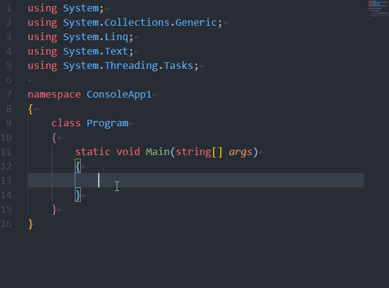
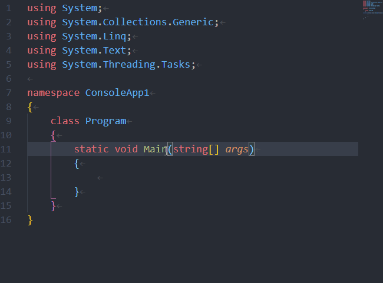
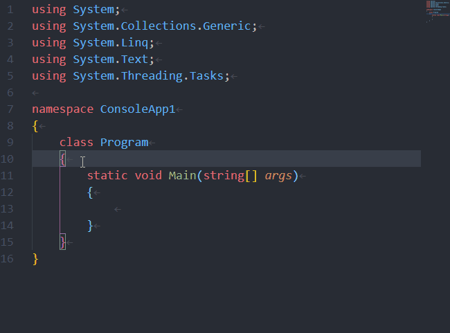
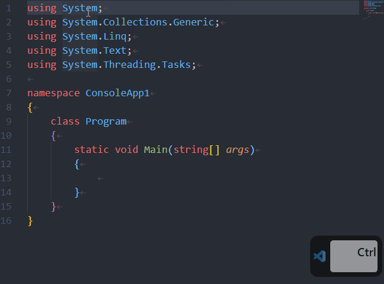
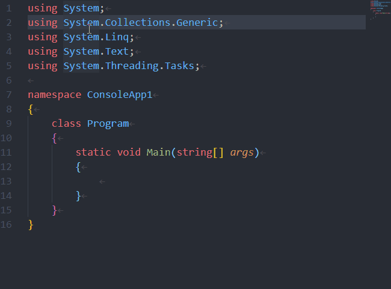

目次
<!-- @import "[TOC]" {cmd="toc" depthFrom=1 depthTo=6 orderedList=false} -->
<!-- code_chunk_output -->

- [VSCode ショートカット一覧](#vscode-ショートカット一覧)
  - [絶対覚える ★★★](#絶対覚える)
    - [カーソル移動・選択系](#カーソル移動選択系)
      - [[Ctrl]+[Home] ファイルの先頭に移動](#ctrlhome-ファイルの先頭に移動)
      - [[Ctrl]+[Home] ファイルの末尾に移動](#ctrlhome-ファイルの末尾に移動)
      - [[Home] 行頭に移動](#home-行頭に移動)
      - [[End] 行末に移動](#end-行末に移動)
      - [[Ctrl]+[←] この単語の先頭に移動](#ctrl-この単語の先頭に移動)
      - [[Ctrl]+[→] この単語の末尾に移動](#ctrl-この単語の末尾に移動)
      - [[Ctrl]+[L] 行頭から1行選択](#ctrll-行頭から1行選択)
      - [[Ctrl]+[D] 同じ単語を選択](#ctrld-同じ単語を選択)
      - [[Ctrl]+[Shift]+[L] 同じ単語をすべて選択](#ctrlshiftl-同じ単語をすべて選択)

<!-- /code_chunk_output -->

# VSCode ショートカット一覧

## 絶対覚える ★★★

### カーソル移動・選択系

#### [Ctrl]+[Home] ファイルの先頭に移動
#### [Ctrl]+[Home] ファイルの末尾に移動

#### [Home] 行頭に移動
#### [End] 行末に移動

#### [Ctrl]+[←] この単語の先頭に移動
#### [Ctrl]+[→] この単語の末尾に移動

#### [Ctrl]+[L] 行頭から1行選択

#### [Ctrl]+[D] 同じ単語を選択

#### [Ctrl]+[Shift]+[L] 同じ単語をすべて選択

